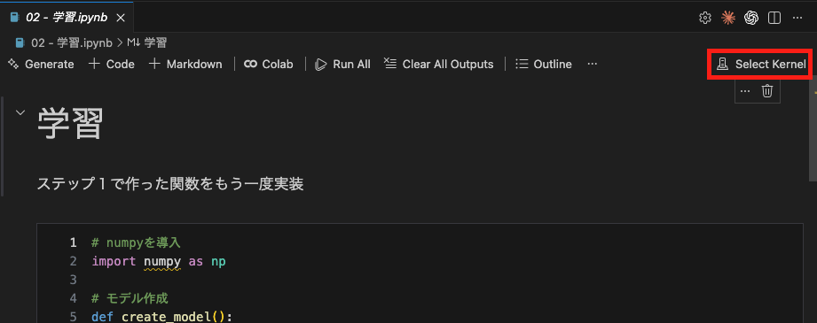
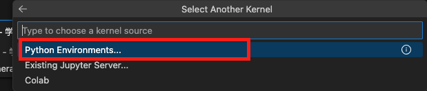
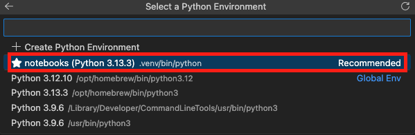

# IPU - iMOS AI Seminar Documentation

このレポジトリでは、岩手県立大学 i-MOS 高度技術者養成講習会の資料をまとめている。

## インストール方法

まず、Anaconda をダウンロードし、インストールしてください。

URL: https://www.anaconda.com/download

その後、このプロジェクトにある環境ファイルを使い、開発環境を設定してください。まず、Anaconda Prompt を開き、チェックアウト、およびダウンロードしたフォルダー上で以下のコマンドを打ち込んでください：

```
conda env create -f environment.yml
```

次に、環境を選択し、jupyter notebook を起動し、各ノートブックを確認できる。

```
conda activate ai-seminar
jupyter notebook
```

## ライセンス

このセミナーの資料は Creative Commons BY-NC-SA 4.0 にて提供されている
https://creativecommons.org/licenses/by-nc-sa/4.0/

---

<br><br><br>

# VSCode で動かす

jupyter notebooks は VScode で手軽に動かすことが出来ます。

ここでは、VScode で colab extention を使った動かし方を書きます。

## Google Colab extension をインストールする


## Python 環境

Jupyternotebook ファイルを開くと Python 実行環境が選べるようになります。
実行環境は、リモートで Google Colab を使うやり方と、ローカル環境で使うやり方があります。



### Google Colab を使うやり方

バックで Google Colab を使うと GPU 使えて処理が速くなります。
select another Kernel から Colab を選択します。


---

<br>

### local 環境で動かす

外部フォルダのデータを使う場合、google colab を使うと Google Drive にマウントするところが上手くいかなかったりします。
なので、その場合ローカル環境を使います。

尚ここでは仮想環境に uv を使います。

```
# mac の場合
$ brew install uv
```

jupyter notebook フォルダに入って、ここに仮想環境を作成します。

```
$ cd ai-seminar/notebooks
$ uv init .
$ source .venv/bin/activate
```

使うライブラリを予めインストールしておきます。

```
$ uv add ipykernel
$ uv add numpy
$ uv add tensorflow # keras は tensorflow と統合されました
$ uv add matplotlib
$ uv add pandas
```

ここで、python 環境を選択します。



